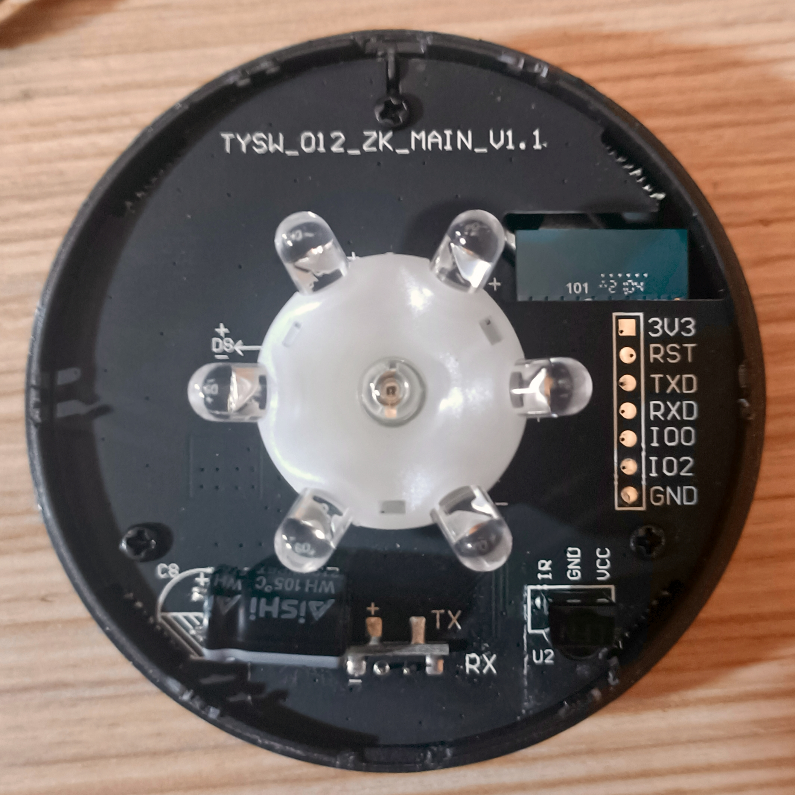

# Яндекс.Пульт (YNDX-0006) — Дамп стоковой прошивки / Stock Firmware Dump

[🇷🇺 Русский](#-русский) | [🇬🇧 English](#-english)

---

# 🇷🇺 Русский

Чистый заводской дамп SPI Flash (1MB / 8Mbit) для умного инфракрасного пульта **Яндекс.Пульт** (модель `YNDX-0006` / `YNDX-00006`, ревизия платы `TYSW_012_ZK_MAIN_V1.1`).

Дамп снят напрямую через UART с рабочего устройства, проверен и очищен от персональных данных Wi-Fi. Подходит для раскирпичивания, восстановления заводского состояния или бэкапа перед переходом на ESPHome / Tasmota.

## ⚠️ Критически важно при прошивке

**Режим Flash: DOUT @ 40MHz**  
Флеш-память на этой плате аппаратно разведена в режиме **DOUT**. **Не используйте QIO или DIO!** При прошивке в неправильном режиме устройство упадет в циклическую перезагрузку (`rst cause:2, boot mode:(3,7)`). В `esptool.py` обязательно указывайте флаг `--flash_mode dout`.

## Аппаратные характеристики

* **Модель:** Яндекс.Пульт (`YNDX-0006` / `YNDX-00006`)
* **Маркировка платы:** `TYSW_012_ZK_MAIN_V1.1`
* **SoC / Модуль:** Espressif **ESP8266EX** (модуль Tuya `TYWE3S`)
* **Объем Flash:** 1 МБ (1,048,576 байт / 8 Мбит SPI Flash)
* **Режим Flash:** **DOUT** @ 40MHz

## Фото платы и распиновка



На плате справа от кругового массива ИК-диодов расположена 7-пиновая отладочная гребенка:

| Пин | Шелкография | Назначение | Подключение |
| :---: | :--- | :--- | :--- |
| **1** | `3V3` | Питание +3.3V | Альтернативное питание 3.3V (не нужно, если пульт питается по Micro-USB) |
| **2** | `RST` | Сброс (Reset) | Активный 0 (подтянуть к GND для сброса) |
| **3** | `TXD` | UART TX (GPIO1) | К контакту **RXD** адаптера |
| **4** | `RXD` | UART RX (GPIO3) | К контакту **TXD** адаптера |
| **5** | `IO0` | Boot Mode (GPIO0) | **Замкнуть на GND при включении** для входа в bootloader |
| **6** | `IO2` | GPIO2 | Подтяжка / не используется |
| **7** | `GND` | Земля | К контакту **GND** адаптера (обязательно общий GND) |

> **Питание устройства при прошивке:**  
> Пульт проще и надежнее всего запитать **штатно через родной порт Micro-USB**. В этом случае к USB-UART адаптеру подключаются только 3 провода: **TXD**, **RXD** и **GND** (общая земля). Либо можно подать 3.3V на пин `3V3` от качественного внешнего стабилизатора.

### Назначение GPIO

| GPIO | Компонент | Схемотехника и логика |
| :--- | :--- | :--- |
| **GPIO14** | ИК-передатчик (7 светодиодов) | Круговой массив 360° через транзистор S8050, ШИМ 38 кГц |
| **GPIO5** | ИК-приемник (`U2`) | Демодулятор VS1838B (38 кГц) для режима обучения |
| **GPIO4** | Синий светодиод статуса | Инвертированная логика (`0` = включен) |
| **GPIO13** | Кнопка сопряжения / сброса | Тактовая кнопка на нижней крышке корпуса, активный `0` |
| **GPIO0** | Выбор режима загрузки (`IO0`) | Активный `0` (к GND при включении) |

## Очистка дампа (Sanitization)

* **0x0FD000 - 0x0FEFFF**: Заполнено `0xFF` (стирает сохраненные сети Wi-Fi, устройство само входит в режим сопряжения SmartConfig).
* **0x0FB000**: Ключи Tuya заменены на плейсхолдеры (`mac_addr` → `001122334455`, `auz_key` → `DUMP_PLACEHOLDER_AUTHKEY_0000000`, `pskKey` → `DUMP_PSK_KEY_000`).

> **Примечание:** Дамп на 100% восстанавливает загрузчик, ядро FreeRTOS и работу ИК-тракта. Для официальной привязки к облаку Яндекса понадобятся оригинальные ключи из вашего бэкапа сектора `0x0FB000`, либо устройство сразу прошивается в **ESPHome** / **Tasmota**.

## Прошивка через `esptool.py`

### 1. Подключение и вход в Bootloader
1. Подключите `TXD` → `RXD` адаптера, `RXD` → `TXD` адаптера, `GND` → `GND`.
2. Замкните `IO0` на `GND`.
3. Подайте питание (вставьте Micro-USB кабель или подайте 3.3V).
4. Разомкните `IO0` от `GND`.

### 2. Запись стокового дампа
```bash
# Запись чистого стока (ОБЯЗАТЕЛЬНО -fm dout!)
esptool.py --port /dev/ttyUSB0 --baud 115200 write_flash   --flash_mode dout --flash_size 1MB   --erase-all   0x0 YNDX-0006_TYSW_012_ZK_MAIN_V1.1_1MB_stock.bin

# Проверка контрольной суммы
esptool.py --port /dev/ttyUSB0 --baud 115200 verify_flash   0x0 YNDX-0006_TYSW_012_ZK_MAIN_V1.1_1MB_stock.bin
```

## Базовый конфиг ESPHome

```yaml
esp8266:
  board: esp01_1m
  flash_mode: dout # Критически важно!

remote_transmitter:
  pin: GPIO14
  carrier_duty_percent: 50%

remote_receiver:
  pin:
    number: GPIO5
    inverted: true
  dump: all

status_led:
  pin:
    number: GPIO4
    inverted: true

binary_sensor:
  - platform: gpio
    pin:
      number: GPIO13
      mode: INPUT_PULLUP
      inverted: true
    name: "Reset Button"
```

---

# 🇬🇧 English

## Yandex Smart IR Remote (YNDX-0006): Stock Firmware

Clean stock firmware dump for the Yandex Smart IR Remote (`YNDX-0006`). Internally, this is a rebranded Tuya TYWE3S (ESP8266EX) device. This repo provides a sanitized binary, full pinout documentation, and a baseline ESPHome config for local use.


### ⚠️ CRITICAL FLASH WARNING

**Flash Mode: DOUT @ 40MHz**  
This device uses a 1MB flash chip configured in DOUT mode. Flashing with `dio`, `qio`, or `qout` **will brick the unit**. Always specify `-fm dout`.

### Pinout & Powering

The board exposes a 7-pin debug header (`3V3`, `RST`, `TXD`, `RXD`, `IO0`, `IO2`, `GND`). Logic level is 3.3V.

> **Power note:** You can simply power the remote via its standard **Micro-USB port** while connecting only 3 wires to your USB-UART adapter: `TXD`, `RXD`, and `GND`. Alternatively, feed 3.3V into pin `3V3`.

| Pin | Function | Notes |
| :-- | :-- | :-- |
| 1 | 3V3 | Optional 3.3V Power In (unneeded if powered via Micro-USB) |
| 2 | RST | Reset (Active LOW) |
| 3 | TXD | UART TX (to USB-UART RXD) |
| 4 | RXD | UART RX (to USB-UART TXD) |
| 5 | IO0 | Boot strap (Pull LOW on boot) |
| 6 | IO2 | Unused / Debug |
| 7 | GND | Ground (Common Ground) |

**GPIO Assignments:**

| GPIO | Function | Hardware Details |
| :-- | :-- | :-- |
| 14 | IR TX | Drives array of 7x S8050 LEDs |
| 5 | IR RX | Connected to VS1838B receiver |
| 4 | Status LED | Active LOW (inverted) |
| 13 | Reset Button | Active LOW |
| 0 | Boot Strap | Flash mode entry |

### Flashing via esptool.py

```bash
# Write clean stock firmware (MUST use -fm dout)
esptool.py --port /dev/ttyUSB0 --baud 115200 write_flash   --flash_mode dout --flash_size 1MB   --erase-all   0x0 YNDX-0006_TYSW_012_ZK_MAIN_V1.1_1MB_stock.bin

# Verify flash integrity
esptool.py --port /dev/ttyUSB0 --baud 115200 verify_flash   0x0 YNDX-0006_TYSW_012_ZK_MAIN_V1.1_1MB_stock.bin
```

---

## Disclaimer

This repository is provided for device repair, recovery, and local interoperability research. All copyrights belong to their respective owners (Yandex / Tuya).
